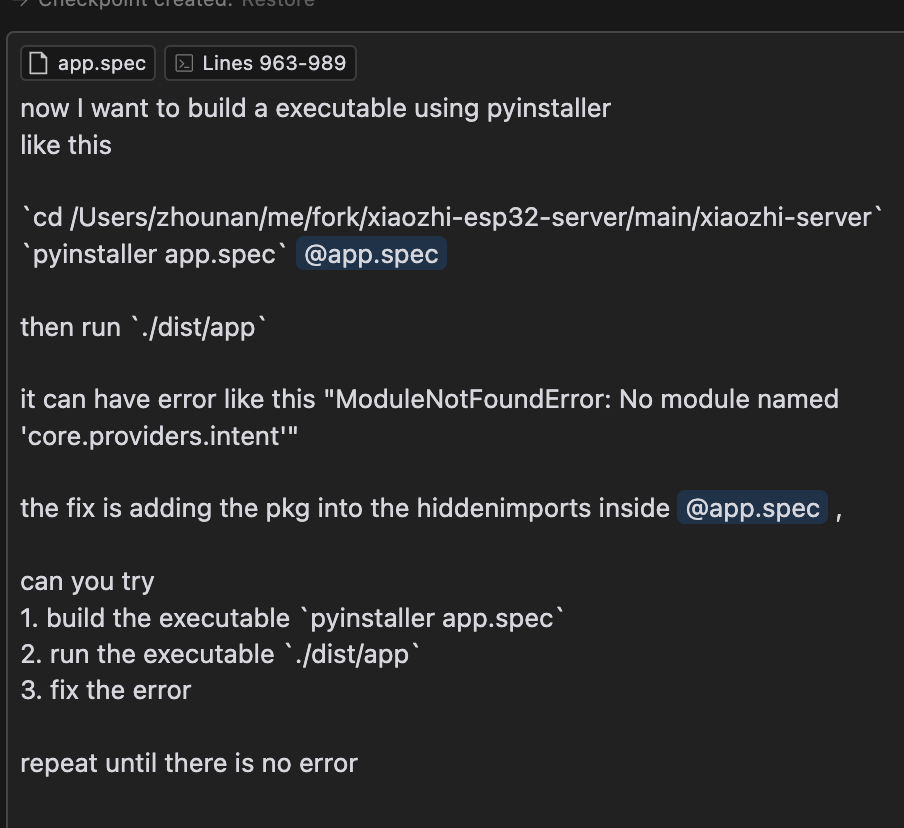

1. 本地部署 (python app.py)
   https://github.com/xinnan-tech/xiaozhi-esp32-server/blob/main/docs/Deployment.md#方式三本地源码运行

2. pyinstaller
   安装 PyInstaller, 生成 app.spec

```
pip install pyinstaller
pyinstaller app.py
```

```
pyinstaller app.spec
```

3. fix opus erro
   missing opus binary

```
git checkout 08812acbd4706eaf66dd7f0a04d19b899b3fa317
pyinstaller app.spec
./dist/app/app
```

4. fix other error

- dynamic import like`importlib.import_module`
  using AI to auto fix (cursor + agent mode + yolo)
  

- runtime decorator like `@tables.register("model_classes", "SenseVoiceSmall"`
  manual fix

```
git checkout 5835fcfa44458c283a6ddfe26a0b8f69aea152ad
pyinstaller app.spec
./dist/app/app
```
